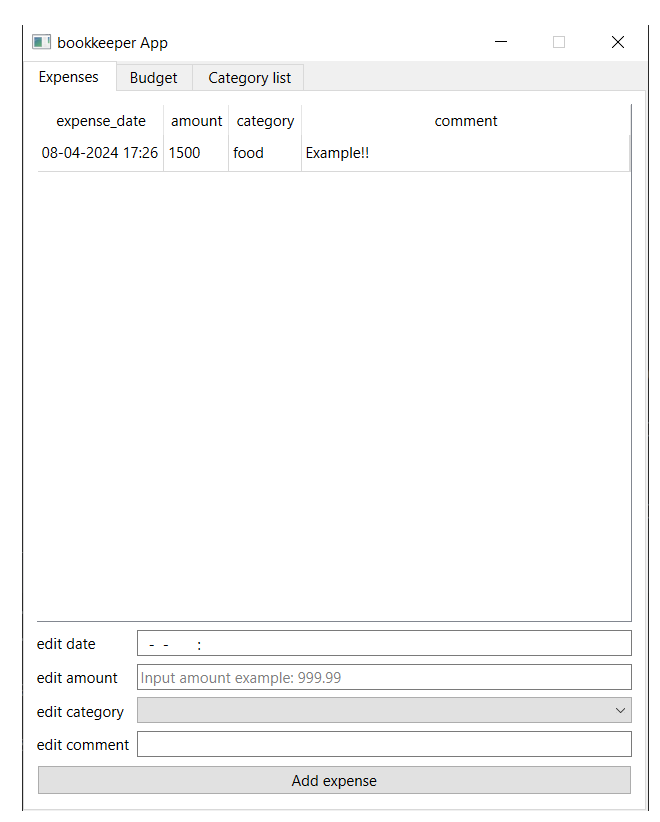
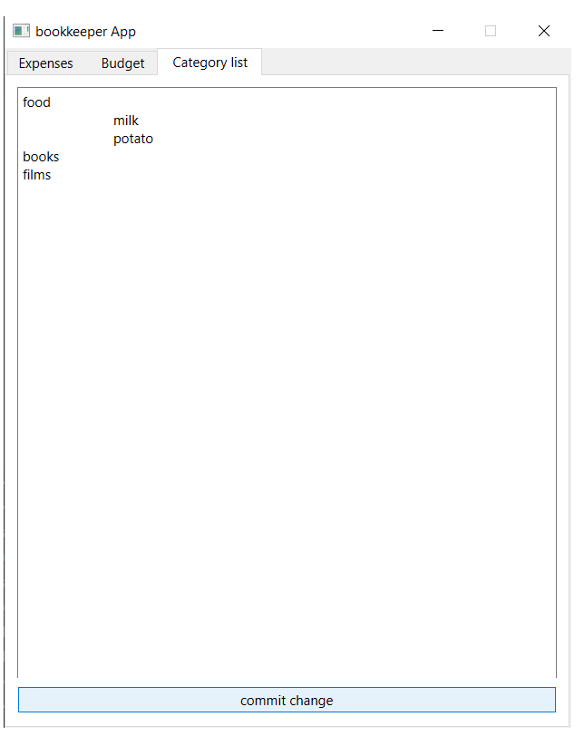
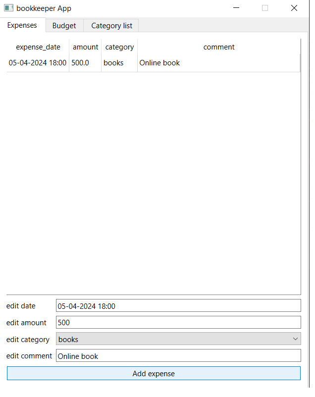
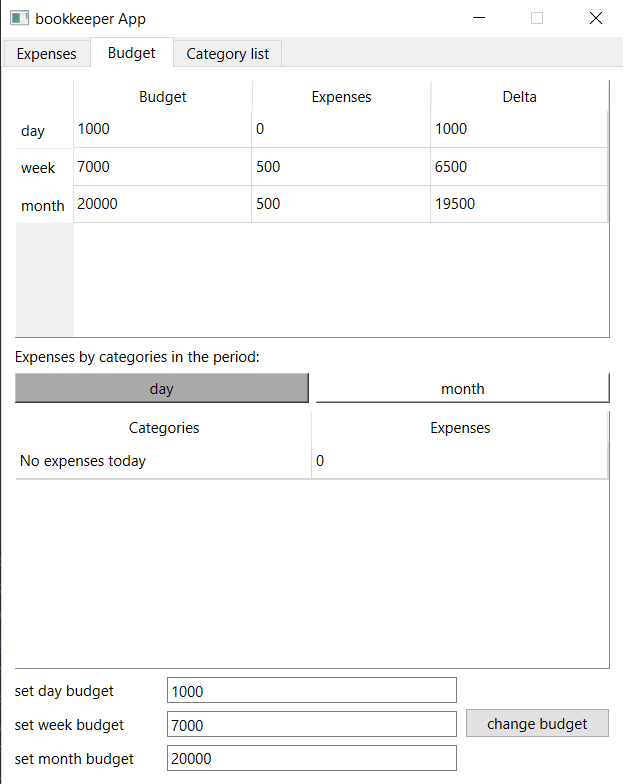
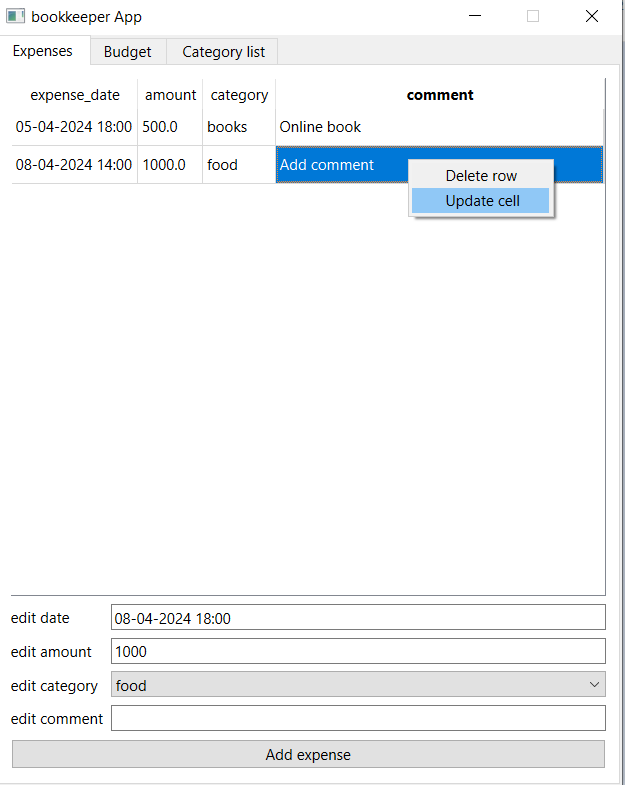
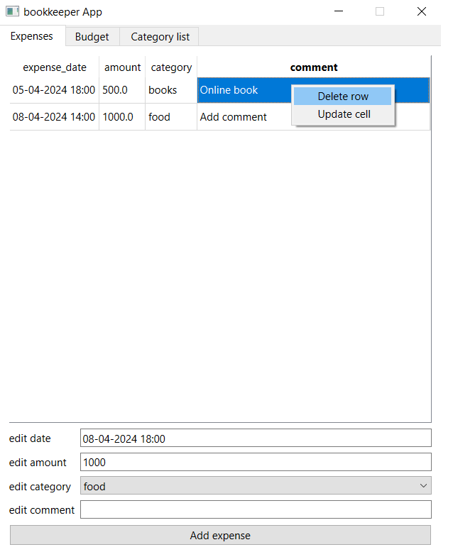

<h1>Программа для управления личными финансами</h1>
<b>(учебный проект для курса по практике программирования на Python)</b>

<h3>Инструкция по запуску</h3>
<ol>
  <li>Настроить виртуальное окружение с пакетами из файла requirements.txt</li>
  <li> Ubuntu - python3 bookkeeper/main_file.py
     
    Windows - python \bookkeeper\main_file.py
  </li>
</ol>

<h3>Описание работы приложения</h3>

  <ol>
    <li>
      При открытии приложения появится окно с тремя вкладкам (Expenses, Budget, Category list)
      Expenses - Таблица с расходами
      Budget - Таблица с бюджетом
      Categort list - список категорий
    </li>
     
    <li>
      Список категорий заполняется на вкладке Category list
      <ul>
        <li> Записываем категории в каждой строке, затем нажимаем кнопку commit changes</li>
        <li> При записи проверяется, что в списке нет двух категорий с одинаковыми названиями без учёта незначащих пробелов. При наличии одинаковых названий выведется окно с предупреждением</li>
      <li>Также можно выделять подкатегории пробелом или табом. В таком случае в БД будет записываться id родительской категории</li>
      </ul>
      
    </li>
    <li>
      Для добавления записи расхода необходимо заполнить соответствующие поля в нужном формате и нажать кнопку Add Expense
      Требования к полям:
      <ul>
        <li>edit date: день - месяц - год час:минута</li>
        <li>edit amount: Число > 0</li>
        <li>edit category: Выбрать из соответствующего списка</li>
        <li>edit comment: строка, можно пустую</li>
      </ul>
    </li>
    
    <li>
      Для установки бюджета необходимо во вкладке Budget заполнить соответствующие поля числа, затем нажать кнопку change budget
       
      NB!!: В начале бюджет равен 0
    </li>
     
    <li>
      Для редактирования расходов необходимо щёлкнуть по ячейк, ввести новые данные, нажать правой кнопкой мыши по ячейке и выбрать update cell
       
      NB!! Если не нажать на update cell, то данные не обновятся
      PS. Можно выбрать несколько ячеек через ALT
    </li>
    
    <li>
      Для удаления строки расхода необходимо выделить любую ячейку, затем нажать правой кнопкой мыши и выбрать delete cell
      PS. Можно выбрать несколько строчек сразу через ALT
    </li>
    
    <li>
      При обновлении категорий расходов, если старых названий нет в новых, то таким строчкам присваивается категория Not stated. Думаю, это лучше чем просто удалять запись. Пусть лучше пользователь сам решит, что с ней делать)
    </li>
  </ol>

